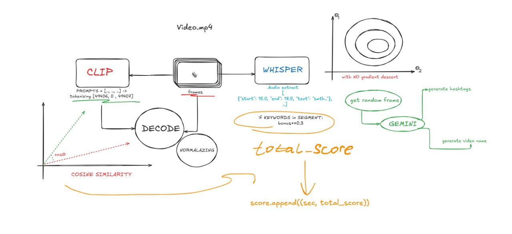

# Edu Highlights Analyzer
### Автоматический анализ образовательных видео с помощью моделей Whisper и CLIP, генерация нарезок с самыми интересными моментами

## Что делает проект
1. Распознаёт аудио с помощью Whisper

2. Извлекает кадры и анализирует их с помощью CLIP

3. Оценивает интересность по визуальному и аудио содержимому используя ключевые слова

4. Генерирует краткую нарезку с топовыми моментами (30 секунд)

5. Добавляет теги и название, созданные нейросетью

6. Упаковывает всё в .zip и отправляет на email

## Пример содержимого письма

```sh
highlights.zip
├── segment_1.mp4
├── segment_2.mp4
├── video_name.txt       # Заголовок/описание от Gemini
├── video_tags.txt       # Хештеги от Gemini
```

## Используемые технологии
1. Python, Django, Django REST Framework

2. OpenAI Whisper — аудио транскрибация

3. React - для фронтенда

4. CLIP — анализ изображений

5. Gemini Vision — генерация описания и тегов

6. ffmpeg — нарезка видео

7. Pillow, OpenCV — работа с изображениями


## 📥 Как пользоваться
1. Отправка запроса:
POST /api/upload-video/

```json
{
  "email": "user@example.com",
  "video": <файл .mp4>
}
```
2. Ответ:
```json
{
  "status": "ok",
  "message": "Анализ завершён, нарезки отправлены на email."
}
```
### А дальше файл-архив оправится в вашу почту с данными

## Под капотом
1. Видео анализируется: каждая секунда получает скоринг.

2. Топ-N (по умолчанию 5) секунд превращаются в таймкоды.

3. По этим таймкодам создаются нарезки по ±15 сек.

4. В случайный кадр подаётся в Gemini для генерации текста/хештегов.

## Схема



### 👥 Авторы

| [](https://github.com/RTMoo) | [](https://github.com/nurikw3) |
|:--:|:--:|
| [@RTMoo](https://github.com/RTMoo) <br> Backend, UI, Scripts | [@nurikw3](https://github.com/nurikw3) <br> AI, ML |
